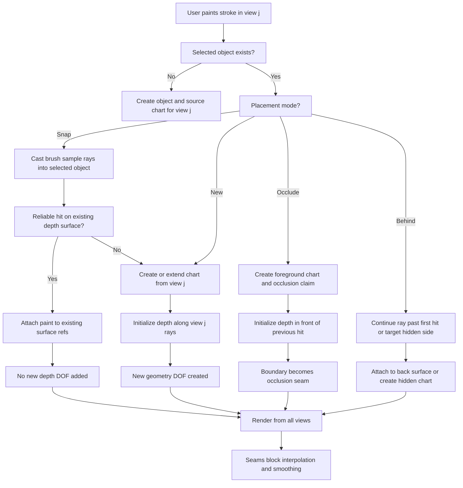

> [!IMPORTANT]
> Largely AI-written text ahead. Review carefully!


# Paint modeling

This note captures the paint-modeling idea so it does not get diluted into a
generic contour or mesh editing workflow.

Paint modeling treats the artist's 2D painting as the primary authored artifact.
Depth is sculpted along the source view rays, so a painted layer keeps the same
appearance from the view where it was painted. Later views add observations on
the same object surface by default; they create new geometry only when snapping
fails or the user explicitly asks for a new surface.

## Core Entities

Each saved view is a calibrated camera:

```text
V_i = (C_i, pi_i, ray_i)

C_i        camera center in world space
F_i        forward unit direction through the center of view i
pi_i(X)   projection from world point X to 2D coordinates in view i
ray_i(u)  unit world ray direction through 2D point u in view i
R_i(u)    ray set { C_i + t ray_i(u) | t > 0 }
```

Each paint object owns one or more surface charts:

```text
Chart c:
  sourceView: V_c
  domain: Omega_c
  depth: d_c(u), u in Omega_c
  seams: S_c subset Omega_c
  paint: color/alpha strokes attached to chart coordinates or surface refs
```

The chart stores view depth. World geometry is reconstructed by converting
that depth to distance along the source view ray:

```text
d_c(u) = dot(X_c(u) - C_c, F_c)
s_c(u) = d_c(u) / dot(ray_c(u), F_c)
X_c(u) = C_c + s_c(u) ray_c(u)
```

The essential source-view invariant is:

```text
pi_c(X_c(u)) = u
```

Depth edits to a source chart must preserve this invariant. Sculpting depth can
move points in 3D, but it must not change the painted appearance from the chart's
source view.

## Degrees Of Freedom

A point on an object is a 3D unknown:

```text
X = (x, y, z)
```

A 2D paint sample from one calibrated view constrains the point to one ray:

```text
X in R_i(u)
```

That leaves one depth degree of freedom. Painting or sculpting depth fixes the
point:

```text
X = C_i + d_i(u) ray_i(u)
```

After that, a same-object paint sample from another view should normally be
interpreted as an observation of the existing surface:

```text
u_j approximately pi_j(X)
```

It should not automatically add an independent depth claim. More views provide
consistency checks and refinement constraints. They do not create new free depth
dimensions for the same surface point unless the user explicitly creates a new
surface, seam side, or occluded layer.

## Cross-View Painting Rule

When painting the same object from a later view, the brush should snap onto the
already-established object depth surface by default.

```text
same object + reliable existing surface hit:
  attach paint to the hit surface reference
  do not add new geometry DOF

same object + no reliable hit:
  create or extend a chart from the current view
  initialize depth along the current view rays

same object + explicit new-surface mode:
  bypass snapping
  create new geometry or a distinct seam side

same object + explicit occluder mode:
  bypass snapping to the first existing hit
  create a foreground surface claim from the current view
  record that it occludes the previous hit over the painted mask
```

This keeps the model artist-friendly: painting from another view recolors or
annotates the existing object unless the user intentionally says they are
building additional form.

## Occlusion From A View

Occlusion should not be represented as only a global toggle. A toggle can be a
convenient UI affordance, but the model needs a per-stroke or per-layer
placement intent that records a view-specific visibility relationship.

Artist-facing placement modes:

```text
Snap / observe:
  default mode
  raycast to the selected object
  attach paint to the first reliable surface hit

New surface:
  ignore snapping
  create or extend a chart from the current view
  no automatic front/back relationship is asserted

Occluding surface:
  ignore snapping to the existing hit
  create or extend a chart from the current view
  assert that the new chart is in front of the existing hit in this view

Paint behind:
  continue past the first hit or target a hidden seam side
  attach paint to a back surface or create a new back chart
  assert that it is occluded by the front surface in this view
```

The recommended UI is a small placement control rather than a single permanent
toggle:

```text
Placement: [Snap] [New] [Occlude] [Behind]
```

`Snap` should remain the default because it preserves same-object consistency.
`Occlude` is the deliberate "do not snap to what is already there; I am drawing
a foreground piece" command. For quick workflows, holding a modifier while
painting can temporarily switch from `Snap` to `Occlude` or `New`.

An occlusion claim is view-local:

```text
OcclusionClaim q:
  view: V_j
  mask: M_j subset image/view coordinates
  frontSurface: surface refs or chart created by the occluding stroke
  backSurface: existing surface hit, hidden chart, or unknown
  boundary: occlusion seam along partial M_j
```

For each pixel/sample `u` inside the occlusion mask, the visibility ordering is:

```text
depth_j(frontSurface, u) < depth_j(backSurface, u)
```

where `depth_j` means camera-forward view depth from `V_j`. This is not the same
as distance along an off-center ray, nor is it a universal object layer order;
another view may see the surfaces side by side, reversed by topology, or not
overlapping at all.

Occlusion boundaries are seams. The front and back surfaces should not be
smoothed together across that boundary:

```text
front and back are distinct surface refs
no vertex sharing across the occlusion boundary
no depth smoothing across the occlusion boundary
raycast may choose front, back, or continue-through based on placement mode
```

When the artist paints an occluder, the system should create a new chart from
the current view and initialize its depth in front of the previous hit:

```ts
function paintOccludingStroke(view Vj, object O, stroke2d) {
  const samples = resample(stroke2d);
  const chart = getOrCreateChart(O, Vj, { role: "occluder" });
  const claim = createOcclusionClaim({ viewId: Vj.id, frontChartId: chart.id });

  for (const y of samples) {
    const ray = makeRay(Vj, y);
    const backHit = raycastObjectSurface(O, ray);
    const u = chartCoordinatesFromViewPoint(chart, y);

    chart.depth[u] = backHit
      ? max(MIN_DEPTH, backHit.viewDepth - OCCLUSION_GAP)
      : initialForegroundDepth(O, Vj, y);

    claim.mask.add(y);
    if (backHit) claim.backRefs.add(backHit.surfaceRef);

    addPaintSample({
      objectId: O.id,
      sourceViewId: Vj.id,
      viewPoint: y,
      surfaceRef: { chartId: chart.id, uv: u },
      placement: "occluding-surface",
      color: brush.color,
      opacity: brush.opacity,
    });
  }

  sealOcclusionBoundaryAsSeam(O, claim);
}
```

The important distinction:

```text
Turning snapping off chooses placement behavior.
Occlusion records a visibility/order claim.
```

So an "ignore snapping" toggle alone is not enough unless it creates an explicit
new surface and records whether that surface is merely new, intentionally in
front, or intentionally behind.

## Paint Stroke Algorithm

```ts
function paintStroke(view Vj, object O, stroke2d, mode = "auto") {
  const samples = resample(stroke2d);

  for (const y of samples) {
    const ray = makeRay(Vj, y);

    if (mode === "occluding-surface") {
      paintOccludingSample(Vj, O, y);
      continue;
    }

    if (mode !== "new-surface" && mode !== "paint-behind") {
      const hit = raycastObjectSurface(O, ray);

      if (isReliableHit(hit, Vj, y)) {
        addPaintSample({
          objectId: O.id,
          sourceViewId: Vj.id,
          viewPoint: y,
          surfaceRef: hit.surfaceRef,
          color: brush.color,
          opacity: brush.opacity,
        });
        continue;
      }
    }

    if (mode === "paint-behind") {
      const backHit = raycastObjectSurfaceBehindFirstHit(O, ray);
      if (isReliableHit(backHit, Vj, y)) {
        addPaintSample({
          objectId: O.id,
          sourceViewId: Vj.id,
          viewPoint: y,
          surfaceRef: backHit.surfaceRef,
          placement: "behind",
          color: brush.color,
          opacity: brush.opacity,
        });
        continue;
      }
    }

    const chart = getOrCreateChart(O, Vj);
    const u = chartCoordinatesFromViewPoint(chart, y);

    if (!chart.hasDepth(u)) {
      chart.depth[u] = initialDepthFromNearbyGeometryOrPlane(O, Vj, y);
    }

    addPaintSample({
      objectId: O.id,
      sourceViewId: Vj.id,
      viewPoint: y,
      surfaceRef: { chartId: chart.id, uv: u },
      color: brush.color,
      opacity: brush.opacity,
    });
  }
}
```

`isReliableHit` should reject hits that are behind another object, too far from
the stroke sample, outside the intended object, or on the wrong side of a seam.

## Depth Sculpt Algorithm

Source-view sculpting edits the source chart directly:

```ts
function sculptDepthFromSourceView(view Vi, object O, brushRegion, delta) {
  for (const chart of O.charts) {
    if (chart.sourceViewId !== Vi.id) continue;

    for (const u of samplesInBrush(chart, brushRegion)) {
      if (crossesSeam(chart, u)) continue;
      chart.depth[u] += delta * brushFalloff(u);
    }
  }
}
```

Non-source-view sculpting should be constrained against existing geometry:

```ts
function sculptDepthFromOtherView(view Vj, object O, brushRegion, delta) {
  const constraints = [];

  for (const y of samplesInBrushView(Vj, brushRegion)) {
    const hit = raycastObjectSurface(O, makeRay(Vj, y));
    if (!isReliableHit(hit, Vj, y)) continue;

    constraints.push({
      surfaceRef: hit.surfaceRef,
      targetDisplacement: delta * brushFalloff(y),
      direction: makeRay(Vj, y).direction,
    });
  }

  solveConstrainedSurfaceEdit(O, constraints, {
    preserveSourceViewProjection: true,
    doNotCrossSeams: true,
  });
}
```

If this constrained edit cannot preserve existing source-view invariants, the UI
should ask the user to create a new chart, split a seam, or switch to an explicit
geometry correction mode.

## Seams

A seam is a curve or mask in chart space where continuity is intentionally
broken:

```text
S_c subset Omega_c
```

Across non-seam neighbors:

```text
X_c(u_a) approximately X_c(u_b)
depth smoothing may propagate
mesh vertices may be shared
```

Across seam neighbors:

```text
no continuity constraint
depth smoothing is blocked
mesh vertices are duplicated
raycast can return distinct surface refs for each side
paint can attach to either side independently
```

Depth discontinuities should be represented as seams rather than extreme smooth
depth gradients. This keeps silhouettes, occlusion boundaries, folds, and layered
forms crisp.

## Constraint Solving View

The object can be interpreted as a set of unknown 3D surface samples `X_k`.
Paint and depth operations add constraints:

```text
Projection constraint:
  pi_i(X_k) = u_ik

Source depth constraint:
  d_i(u_ik) = dot(X_k - C_i, F_i)
  X_k = C_i + d_i(u_ik) / dot(ray_i(u_ik), F_i) * ray_i(u_ik)

Same-object later-view paint:
  pi_j(X_k) approximately u_jk
  X_k already exists, so prefer snapping to solving a new point

Smoothness constraint, except across seams:
  X_a approximately X_b for neighboring samples a, b

Seam constraint:
  no equality or smoothing term between samples across S_c

Occlusion ordering constraint:
  depth_j(X_front) < depth_j(X_back) for samples inside M_j
```

The default objective for refinement is:

```text
minimize:
  source_view_projection_error
  + later_view_observation_error
  + occlusion_ordering_error
  + smoothness_error_inside_seam_regions
  + edit_regularization

subject to:
  no smoothing across seams
  no implicit topology merge across seams
  source-view paint appearance remains invariant unless explicitly overridden
```

## Flowchart



## Current Implementation Gap

The current prototype stores a single `DepthSurface` per `DepthPaintObject` and
maps strokes by intersecting the active view ray with an object paint plane. The
depth map is then sampled for projection.

That is a useful prototype, but it is not the full formal model above. The next
implementation step should replace plane-first stroke placement with this order:

1. Raycast the active view brush sample against the existing depth-derived
   object surface.
2. If the hit is reliable, attach the paint sample to that surface reference.
3. If no reliable hit exists, create or extend a source-view chart.
4. Store depth as camera-forward view depth in the chart source view.
5. Add explicit placement modes for snap, new surface, occluding surface, and
   behind surface.
6. Record occlusion claims as view-local depth ordering constraints.
7. Use seam masks to split continuity and block smoothing.

The sentence to preserve:

```text
A same-object stroke from a later view is a color observation on the existing
surface by default; it becomes a new depth or geometry claim only when raycast
snapping fails or the user explicitly creates a new surface.
```
