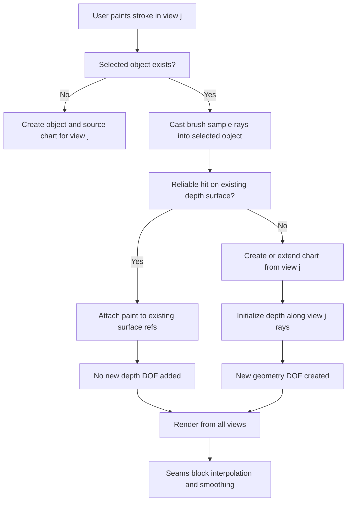

> [!IMPORTANT]
> Largely AI-written text ahead. Review carefully!


# Paint modeling

This note captures the paint-modeling idea so it does not get diluted into a
generic contour or mesh editing workflow.

Paint modeling treats the artist's 2D painting as the primary authored artifact.
Depth is sculpted along the source view rays, so a painted layer keeps the same
appearance from the view where it was painted. Later views add observations on
the same object surface by default; they create new geometry only when snapping
fails or the user explicitly asks for a new surface.

## Core Entities

Each saved view is a calibrated camera:

```text
V_i = (C_i, pi_i, ray_i)

C_i        camera center in world space
pi_i(X)   projection from world point X to 2D coordinates in view i
ray_i(u)  unit world ray direction through 2D point u in view i
R_i(u)    ray set { C_i + t ray_i(u) | t > 0 }
```

Each paint object owns one or more surface charts:

```text
Chart c:
  sourceView: V_c
  domain: Omega_c
  depth: d_c(u), u in Omega_c
  seams: S_c subset Omega_c
  paint: color/alpha strokes attached to chart coordinates or surface refs
```

The chart defines world geometry by unprojecting along the source view ray:

```text
X_c(u) = C_c + d_c(u) ray_c(u)
```

The essential source-view invariant is:

```text
pi_c(X_c(u)) = u
```

Depth edits to a source chart must preserve this invariant. Sculpting depth can
move points in 3D, but it must not change the painted appearance from the chart's
source view.

## Degrees Of Freedom

A point on an object is a 3D unknown:

```text
X = (x, y, z)
```

A 2D paint sample from one calibrated view constrains the point to one ray:

```text
X in R_i(u)
```

That leaves one depth degree of freedom. Painting or sculpting depth fixes the
point:

```text
X = C_i + d_i(u) ray_i(u)
```

After that, a same-object paint sample from another view should normally be
interpreted as an observation of the existing surface:

```text
u_j approximately pi_j(X)
```

It should not automatically add an independent depth claim. More views provide
consistency checks and refinement constraints. They do not create new free depth
dimensions for the same surface point unless the user explicitly creates a new
surface, seam side, or occluded layer.

## Cross-View Painting Rule

When painting the same object from a later view, the brush should snap onto the
already-established object depth surface by default.

```text
same object + reliable existing surface hit:
  attach paint to the hit surface reference
  do not add new geometry DOF

same object + no reliable hit:
  create or extend a chart from the current view
  initialize depth along the current view rays

same object + explicit new-surface mode:
  bypass snapping
  create new geometry or a distinct seam side
```

This keeps the model artist-friendly: painting from another view recolors or
annotates the existing object unless the user intentionally says they are
building additional form.

## Paint Stroke Algorithm

```ts
function paintStroke(view Vj, object O, stroke2d, mode = "auto") {
  const samples = resample(stroke2d);

  for (const y of samples) {
    const ray = makeRay(Vj, y);

    if (mode !== "new-surface") {
      const hit = raycastObjectSurface(O, ray);

      if (isReliableHit(hit, Vj, y)) {
        addPaintSample({
          objectId: O.id,
          sourceViewId: Vj.id,
          viewPoint: y,
          surfaceRef: hit.surfaceRef,
          color: brush.color,
          opacity: brush.opacity,
        });
        continue;
      }
    }

    const chart = getOrCreateChart(O, Vj);
    const u = chartCoordinatesFromViewPoint(chart, y);

    if (!chart.hasDepth(u)) {
      chart.depth[u] = initialDepthFromNearbyGeometryOrPlane(O, Vj, y);
    }

    addPaintSample({
      objectId: O.id,
      sourceViewId: Vj.id,
      viewPoint: y,
      surfaceRef: { chartId: chart.id, uv: u },
      color: brush.color,
      opacity: brush.opacity,
    });
  }
}
```

`isReliableHit` should reject hits that are behind another object, too far from
the stroke sample, outside the intended object, or on the wrong side of a seam.

## Depth Sculpt Algorithm

Source-view sculpting edits the source chart directly:

```ts
function sculptDepthFromSourceView(view Vi, object O, brushRegion, delta) {
  for (const chart of O.charts) {
    if (chart.sourceViewId !== Vi.id) continue;

    for (const u of samplesInBrush(chart, brushRegion)) {
      if (crossesSeam(chart, u)) continue;
      chart.depth[u] += delta * brushFalloff(u);
    }
  }
}
```

Non-source-view sculpting should be constrained against existing geometry:

```ts
function sculptDepthFromOtherView(view Vj, object O, brushRegion, delta) {
  const constraints = [];

  for (const y of samplesInBrushView(Vj, brushRegion)) {
    const hit = raycastObjectSurface(O, makeRay(Vj, y));
    if (!isReliableHit(hit, Vj, y)) continue;

    constraints.push({
      surfaceRef: hit.surfaceRef,
      targetDisplacement: delta * brushFalloff(y),
      direction: makeRay(Vj, y).direction,
    });
  }

  solveConstrainedSurfaceEdit(O, constraints, {
    preserveSourceViewProjection: true,
    doNotCrossSeams: true,
  });
}
```

If this constrained edit cannot preserve existing source-view invariants, the UI
should ask the user to create a new chart, split a seam, or switch to an explicit
geometry correction mode.

## Seams

A seam is a curve or mask in chart space where continuity is intentionally
broken:

```text
S_c subset Omega_c
```

Across non-seam neighbors:

```text
X_c(u_a) approximately X_c(u_b)
depth smoothing may propagate
mesh vertices may be shared
```

Across seam neighbors:

```text
no continuity constraint
depth smoothing is blocked
mesh vertices are duplicated
raycast can return distinct surface refs for each side
paint can attach to either side independently
```

Depth discontinuities should be represented as seams rather than extreme smooth
depth gradients. This keeps silhouettes, occlusion boundaries, folds, and layered
forms crisp.

## Constraint Solving View

The object can be interpreted as a set of unknown 3D surface samples `X_k`.
Paint and depth operations add constraints:

```text
Projection constraint:
  pi_i(X_k) = u_ik

Source depth constraint:
  X_k = C_i + d_i(u_ik) ray_i(u_ik)

Same-object later-view paint:
  pi_j(X_k) approximately u_jk
  X_k already exists, so prefer snapping to solving a new point

Smoothness constraint, except across seams:
  X_a approximately X_b for neighboring samples a, b

Seam constraint:
  no equality or smoothing term between samples across S_c
```

The default objective for refinement is:

```text
minimize:
  source_view_projection_error
  + later_view_observation_error
  + smoothness_error_inside_seam_regions
  + edit_regularization

subject to:
  no smoothing across seams
  no implicit topology merge across seams
  source-view paint appearance remains invariant unless explicitly overridden
```

## Flowchart



## Current Implementation Gap

The current prototype stores a single `DepthSurface` per `DepthPaintObject` and
maps strokes by intersecting the active view ray with an object paint plane. The
depth map is then sampled for projection.

That is a useful prototype, but it is not the full formal model above. The next
implementation step should replace plane-first stroke placement with this order:

1. Raycast the active view brush sample against the existing depth-derived
   object surface.
2. If the hit is reliable, attach the paint sample to that surface reference.
3. If no reliable hit exists, create or extend a source-view chart.
4. Store depth as distance along the chart source view ray.
5. Use seam masks to split continuity and block smoothing.

The sentence to preserve:

```text
A same-object stroke from a later view is a color observation on the existing
surface by default; it becomes a new depth or geometry claim only when raycast
snapping fails or the user explicitly creates a new surface.
```
